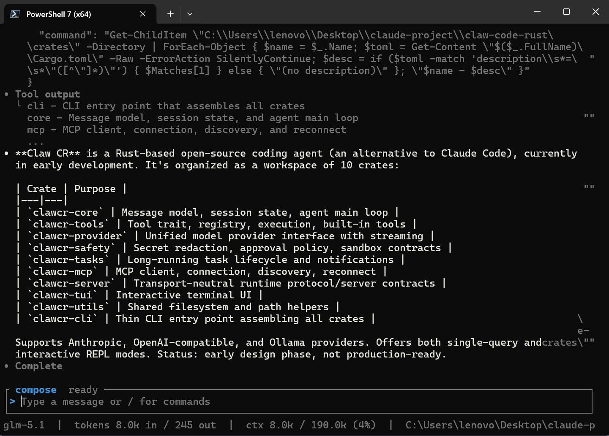

<div align="center">

# 🦀 Claw CR

**The open source coding agent, built in Rust. alternative of ClaudeCode**

[](https://github.com/)
[](https://www.rust-lang.org/)
[](https://docs.anthropic.com/en/docs/claude-code)
[](./LICENSE)
[](https://github.com/)

[English](./README.md) | [简体中文](./docs/i18n/README.zh-CN.md) | [日本語](./docs/i18n/README.ja.md) | [한국어](./docs/i18n/README.ko.md) | [Español](./docs/i18n/README.es.md) | [Français](./docs/i18n/README.fr.md)

🚧Early-stage project under active development — not production-ready yet.

⭐ Star us to follow 

<div style="text-align:center;">
  
</div>

---

## 📖 Table of Contents

- [What is This](#-what-is-this)
- [Quick Start](#-quick-start)
- [Design Goals](#-design-goals)
- [Contributing](#-contributing)
- [References](#-references)
- [License](#-license)

## 💡 What is This

This project extracts the core runtime ideas from [Claude Code](https://docs.anthropic.com/en/docs/claude-code) and reorganizes them into a set of reusable Rust crates.

Think of it as an **agent runtime skeleton**:

| Layer | Role |
|-------|------|
| **Top** | A thin CLI that assembles all crates |
| **Middle** | Core runtime: message loop, tool orchestration, permissions, tasks, model abstraction |
| **Bottom** | Concrete implementations: built-in tools, MCP client, context management |

> If the boundaries are clean enough, this can serve not only Claude-style coding agents, but any agent system that needs a solid runtime foundation.

## 🚀 Quick Start

<!-- ### Install -->

No stable release yet — you can build the project from source using the instructions below.

### Build

Make sure you have Rust installed, 1.75+ recommended (via https://rustup.rs/).

```bash
git clone https://github.com/claw-cli/claw-code-rust && cd claw-code-rust
cargo build --release

# linux / macos
./target/release/clawcr onboard

# windows
.\target\release\clawcr onboard
```

## 🤝 Contributing

Contributions are welcome! This project is in its early design phase, and there are many ways to help:

- **Architecture feedback** — Review the crate design and suggest improvements
- **RFC discussions** — Propose new ideas via issues
- **Documentation** — Help improve or translate documentation
- **Implementation** — Pick up crate implementation once designs stabilize

Please feel free to open an issue or submit a pull request.

## 📄 License

This project is licensed under the [MIT License](./LICENSE).

---

**If you find this project useful, please consider giving it a ⭐**
